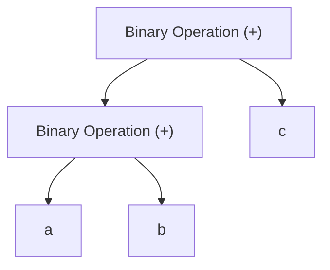

An **Abstract Syntax Tree (AST)** is a structured representation of an
expression. It captures the logical structure, showing how the expression is
evaluated step by step.

The expression `a + b + c` becomes a chain of **Binary Operations**. The tree
shows how the expression is grouped and how evaluation proceeds: from the lower
nodes upward, with the root node being the last operation to evaluate.

Test.
