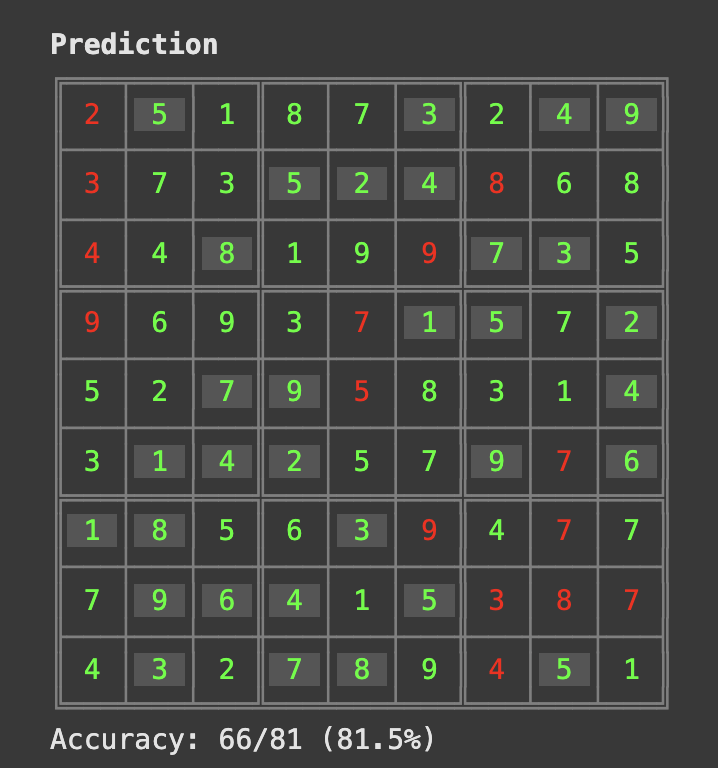

Motivated by the paper
[[Less is More: Recursive Reasoning with Tiny Networks (Paper)]], I have decided
to explore the idea of using small neural networks to solve Sudoku puzzles.

My plan is to start understanding the paper, catch up with terminology and
latest advances in the neural networks world (I have been away of the
[[Machine Learning]] world for a while), and then implement a small network that
can learn to solve Sudokus.

It all started with the [[Hierarchical Reasoning Models (HRM)]] paper which was
quite a sensation. In
[The Hidden Drivers of HRM's Performance on ARC-AGI](https://arcprize.org/blog/hrm-analysis).
they analyzed what made the HRM model work so well on ARC-AGI with so few
parameters. Based on the conclusions, Tiny Recursive Models (TRM) are a
simplified and smaller version that generalizes better than HRM on reasoning
tasks. In fact it is so simplified that it removes the hierarchy and uses a
single network for everything.

I am going to document here my journey trying to replicate the results of TRM
and, hopefully, improve on them.

# Day 1

Reading the paper and loading the dataset.

After reading the paper a question arises: how different is this from an "old"
RNN? I do not see much difference, except that RNNs are applied to sequences and
here we are applying it to the same input + hidden state. In fact it also
reminds me a bit of diffusion models, where the same network is applied multiple
times to the same input (with added noise at each step).

I download the TRM paper's code and see that it's not even possible to run it on
Google Colab, the 14GB TPUs fall short. Moreover, the repo says the training
time is about 24 hours for the sudoku problem, so it's not viable for me... I'm
disappointed because I assumed that having only 7M parameters it would be
possible to train it on a GPU accessible to me. Anyway, I move forward with the
idea of training a small network to solve sudokus. If not following the TRM
paper, I'll do it my own way.

Using the dataset from
[sapientinc/sudoku-extreme](https://huggingface.co/datasets/sapientinc/sudoku-extreme).
I create a pytorch Dataset to load sudokus in vector or grid form. The dataset
has 3M training examples and about 400k test examples. The idea would be to
train on only 1k examples, like in the paper.

# Day 2

Overfitting a small dataset of 1000 sudokus with a small feedforward NN. Zero
error in training set.

https://github.com/guiferviz/me/commit/816bb31b1543432062c3736b929fcc641dd5da80

# Day 3

Si uso redes más pequeñas que no llegan a memorizar los training examples, el
test accuracy se queda en un 16%. After un overfitting de libro, me llama la
atención que cuando hago overfitting el test accuracy sube a 25% aprox.

El día 3 lo dedico a entender cuál es el baseline que debemos batir. Se puede
considerar que un 25% ya es aprender algo?

Creo un random model que simplemente llena los espacios vacíos con números
aleatorios y evalúo su rendimiento en el conjunto de prueba. Respeta los números
dados, solo rellena aleatoriamente los vacíos. Eso da un accuracy teórico de
40%.

Aprovecho también para crear una visualización en la terminal del sudoku, con
colores que marcan los números correctos del intento de solución.

Podríamos incluso crear un random model que devuelva permutaciones. En lugar de
poder repetir 9 veces el mismo numero en una fila, columna o región, podríamos
asegurarnos de que cada número solo aparezca una vez por fila, columna y región.
Aunque no sé si eso mejoraría el baseline, creo que hasta lo empeoraría, porque
la probabilidad de tener el numero correcto ya no sería de 1/9...

# Day 4

Modelos que toman embeddings como inputs y devuelven embeddings como outputs.
También le añado un hidden state para que no tenga que codificar su pensamiento
en el vector de la salida.

Nada de esto hace que pueda superar el 25% de accuracy en test. En train hace
overfitting muy fácilmente.

El modelo consiste en 2 linear layers con ReLU en medio. Decido usar
self-attention, add & norm, y un MLP con un ultimo add & norm, siguiendo el
paper de TRM. Lo cierto es que con eso aprende a no tocar los numeros dados,
pero colapsa y predice siempre el mismo numero en todas las celdas vacías (un 4,
luego un 7...). Le dedico un tiempo a aprender sobre los transformers y entender
los conceptos de key, query, value, multi-head attention, etc. Escribo
[[Understanding Query, Key, and Value in Attention Mechanisms]].

# Day 5

Dando un paseo se me ocurre que la manera en la que le estoy pasando los datos a
la red hace que le sea difícil aprender información espacial. Es decir, si hay
un 7 en la casilla (0, 0) yo le paso a la red un embedding del número 7. Ese
mismo embedding se le pasará a todos los 7 que haya en el sudoku,
independientemente de su posición. Digamos que yo estoy dejando a la red que
aprenda que la primera entrada que le paso es siempre la casilla (0, 0), pero
claro, llegar a aprender eso es muy difícil solo multiplicando inputs por pesos.
Si le pasáramos esa información de posición directamente sería mucho más fácil.
Se me ocurre pasarle un embedding de posición junto con el embedding del número.
De manera que aprenda embeddings de posición y se los sume o concatene a los
embeddings de los números. También se me ocurre que podría pasarle simplemente
unos valores fijos en función de la fila y columna que nos encontremos, como
unos desplazamientos fijos que la red aprendería a interpretar correctamente.

Resulta que esto existe y es clave en las arquitecturas actuales. Existe de
distintas formas: totalmente aprendibles como lo que propongo, fijos para
indicar posiciones absolutas o transformaciones de las matrices Q y K para
indicar posiciones relativas (RoPE). Muy interesante este mundo.

Decido por simplicidad empezar con aprender embeddings de posición, la parte
negativa es que no extiende a problemas mas grandes. Por ejemplo, si quiero
resolver sudokus de 12x12, tendría que aprender nuevos embeddings de posición.
Pero bueno, para empezar está bien.

También pienso que si el sudoku tuviera restricciones como "las celdas en
posiciones pares deben ser números menores que la casilla central", entonces la
red le sería difícil aprender esto con posiciones relativas. Le sería más fácil
con posiciones absolutas (embeddings aprendidos de cero). Esto no es un problema
por ahora, pero si en el futuro quiero aplicar esto a otros problemas de
razonamiento, puede ser relevante.

El día 5 termina con esta investigación.

# Day 6

Toca implementar lo averiguado durante el día 5.

Añado el embedding de posición en el modelo InEmbeddingsOutLogitModel y no veo
diferencia. Luego creo un nuevo modelo PositionalEmbeddingsModel que usa
self-attention, add & norm, y feed-forward con add & norm. Este modelo, con una
sola pasada, es capaz de conseguir un 56% de accuracy en test. También es cierto
que estoy usando 10k ejemplos de training, no 1k como en los experimentos
anteriores. Pero bueno, es un gran avance.

Ahora toca ver que pasa si hago múltiples pasadas por el mismo módulo de
atención + add & norm + feed-forward + add & norm.

Con 2 pasadas consigo un 61% de accuracy en test tras 500 iteraciones. Sigo
usando 10k. Hago una ejecución en google colab y me toma 11 minutos. El modelo
en estos momentos tiene 56k parámetros.

https://github.com/guiferviz/me/commit/d504d7661282ddde7d6302d3a328383aafecf6b8

Con 4 pasadas prácticamente no mejora, se queda en 61%. Observando algunos de
los ejemplos de test veo que el modelo pone números en las posiciones correctas
cuando la lógica a usar es sencilla, como cuando solo hay un lugar posible para
colocar un número en una fila. Incluso cuando hay dos sitios posibles donde
poner un número, la salida dice que es en uno de esos lugares (acertando uno de
ellos siempre). Sin embargo, la solución final está lejos de ser correcta, y hay
salidas que no respetan las reglas básicas. Parece que tras varias iteraciones,
el modelo simplemente se empeña en no cambiar su predicción inicial.



Pruebo con embeddings de 256 en lugar de 64 y consigo un 61% muy rápido y luego
empieza a caer mientras el accuracy del train sube (overfitting).

La única forma de conseguir mejorar el test accuracy es aumentando el número de
ejemplos de training. Con 100k ejemplos consigo un 65% de accuracy en test. Lo
consigo con embeddings de 256 y con 4 layers, pero sin razonamiento adicional (1
iteración). También uso 8 attention heads.

También conseguimos un hito con este modelo: el primer sudoku resuelto
completamente por la red! Antes no había conseguido ninguno completo, solo
números sueltos en posiciones correctas.

En resumen, probando distintas configuraciones, el test accuracy máximo que
consigo es de 65%, por lo que parece difícil que tocando algún hyperparámetro
pueda mejorar mucho más. Quizás pueda llegar a 70% con suerte, pero no creo que
pueda resolver el 80% de los sudokus sin nada más.

https://github.com/guiferviz/me/commit/bb03e711d54f30986deff1ba88fc65bfe1521b65

# Day 7

Antes de seguir, decido ponerme a pensar. Cada idea que tiene un mínimo de
sentido la apunto aquí.

> igual que los humanos tienen un conjunto de train y test y se dan cuenta que
> cuando baja el error en train están haciendo overfitting, podemos pasarle un
> conjunto de test al modelo para que el mismo se de cuenta y se auto ajuste? No
> me refiero a un conjunto de validación para elegir hyperparámetros, sino para
> que los use para ajustar sus pesos o la forma en la que los actualiza.

> Podemos hacer que dado el error de train y test, el modelo aprenda cómo
> descender los parámetros para minimizar ambos errores pero sin ver ejemplos de
> tests?

> Podemos crear un decoder que genere tokens sobre los que razonar y luego
> convertir eso en salidas?

> Una nueva cabeza que diga lo seguro que está. Cuanto más seguro y erróneo, más
> penalización. Menos penalización si no está tan seguro. No penalización si
> acierta. Esto se puede hacer con los logits del softmax, sin una cabeza extra.

> Dejar que piense sobre los tokens del tablero, pero romper el proceso. Es
> decir, después de cada iteración, olvidar lo que se pensó y volver a
> inyectarle a la red la solución anterior convertida en embeddings. O sea,
> tablero a embeddings, embeddings a transformer, transformer a logits, logits a
> tablero, tablero a embeddings... así sucesivamente hasta que el modelo nos
> diga que está resuelto.
>
> Creo que esto tiene mucho sentido porque en sudoku, al menos yo, razono sobre
> el propio tablero. No necesito un scratchpad para pensar. En otros problemas
> seguramente sí, pero aquí se trata de ir refinando las posibilidades de cada
> casilla.

> Aprendizaje guiado. Podemos decirle que cierto número está mal porque debe
> prestar atención a la celda X e Y, por ejemplo. O sea, no le decimos el porqué
> pero le indicamos dónde tiene que atender.

> podriamos hacer que el modelo explore qué otras opciones tiene para llegar a
> la conclusión a la que llegó? es decir, que en cierto modo evalue distinta
> logica y elija la mas probable. Por ejemplo, si sabe que hay un 1 en la
> casilla de arriba al a izquierda, que considere el porqué va ahí, no solo
> usando lo que su atención actual le ha dicho, pero evaluando que otras cosas
> puede atender que le den la misma solución. o sea no es CoT o ToT, es, estoy
> hablando en tiempo de entrenamiento. que el modelo se pregunte si atender a
> ciertos tokens tiene sentido y si eso le ayuda en otros casos u mejor cambiar
> su atencion, ves la diferencia?

Después de tantas ideas cuál es más interesante de explorar? Probar si puedo
replicar el rendimiento de las TRN o probar alguna de las ideas anteriores de mi
propia cosecha? Es importante señalar que el que sean de mi propia cosecha no
quiere decir que no se hayan hecho antes.

# Day 8

Decido mejorar el dataset para que esté más limpio y optimizado. También creo un
anywidget que me permita visualizar fácilmente los sudokus, las celdas
iniciales, los errores y el valor de confianza de cada celda.

Después entreno varios modelos, probando con distintas funciones de loss. La
función final combina tres términos: la pérdida de entropía cruzada estándar que
guía al modelo hacia las respuestas correctas, una penalización cuadrática por
exceso de confianza en errores (lambda*over * (confidence*on_errors²).mean())
que castiga duramente cuando el modelo se equivoca con alta seguridad, y una
penalización general por falta de confianza (lambda_confidence * (1 -
max_probs).mean()) que empuja al modelo a estar seguro en todas sus
predicciones. El equilibrio entre estos términos hace que el modelo aprenda a
ser confiado cuando acierta (recompensa) y cauto cuando falla (doble castigo),
evitando que colapse hacia predicciones uniformes o tímidas para minimizar
pérdidas.

```
TrainingSettings(
    device="cuda",
    embedding_dim=256,
    reasoning_layers=4,
    block_iterations=1,
    attention_heads=8,
    hidden_dim=256,
    dataset=dataset_config,
    batch_size = 1000,
    example_interval=1,
    learning_rate=0.001,
    lambda_over=1.5,
    lambda_under=0.5,
)
```

Después pruebo a hacer predicciones step by step, hago que tras una pasada de la
red, me quedo solo con el valor con el que está más seguro y lo fijo en la
siguiente iteración. De esta manera, la red no puede dudar, una vez elige un
valor, ese valor se queda. Esto hace que pase de resolver un 0.2% de los sudokus
de test enteros a resolver un 4.4%. Algo es algo.

Seguramente sea capaz de resolver sudokus fáciles, pero no los difíciles.
Explorando los resultados me doy cuenta de que está muy seguro en celdas donde
solo hay un numero que se puede poner (naked single), o porque es el único sitio
donde se puede poner dicho número en la fila, columna o región (hidden single).
El dataset tiene un score de dificultad que no estoy usando, y sería interesante
incorporar para entender dónde está fallando más.

# Day 9

El objetivo es hacer que la red neuronal lo haga todo, end to end, que se apañe
con lo que le pasamos sin nosostros proporcionarle knowledge extra (expert
knowledge). Sin embargo, durante las fases iniciales del proyecto podemos probar
con data augmentation, especialmente porque no queremos que los dígitos tengan
más importancia de la que realmente tienen. Que haya un 1 en una casilla no
significa nada, lo que es importante ese que ese mismo símbono no se repita en
la fila, columna o región. Por lo tanto, podemos hacer data augmentation
permutando los dígitos del 1 al 9 en el sudoku. Esto ayuda a que la red no se
fije en patrones específicos de los dígitos.

Con esto conseguimos mejorar el accuracy en test de 65% a 67%. El porcentaje de
sudokus de test acertados a la primera sube al 1% y, si los resolvemos paso a
paso llegamos a un 14.6%. El accuracy en celdas individuales no representa un
gran salto, sin embargo, el accuracy de step by step es realmente una mejora
sustancial.

```
TrainingSettings(
    device="cuda",
    embedding_dim=256,
    reasoning_layers=4,
    block_iterations=1,
    attention_heads=8,
    hidden_dim=256,
    dataset=dataset_config,
    batch_size=1000,
    example_interval=1,
    learning_rate=0.001,
    lambda_over=2,
    lambda_confidence=0,
    use_digit_permutation=True,
)
```

Using code in this commit:
https://github.com/guiferviz/me/commit/e02581bb212f4897a853e6792ce9168242b5562c
